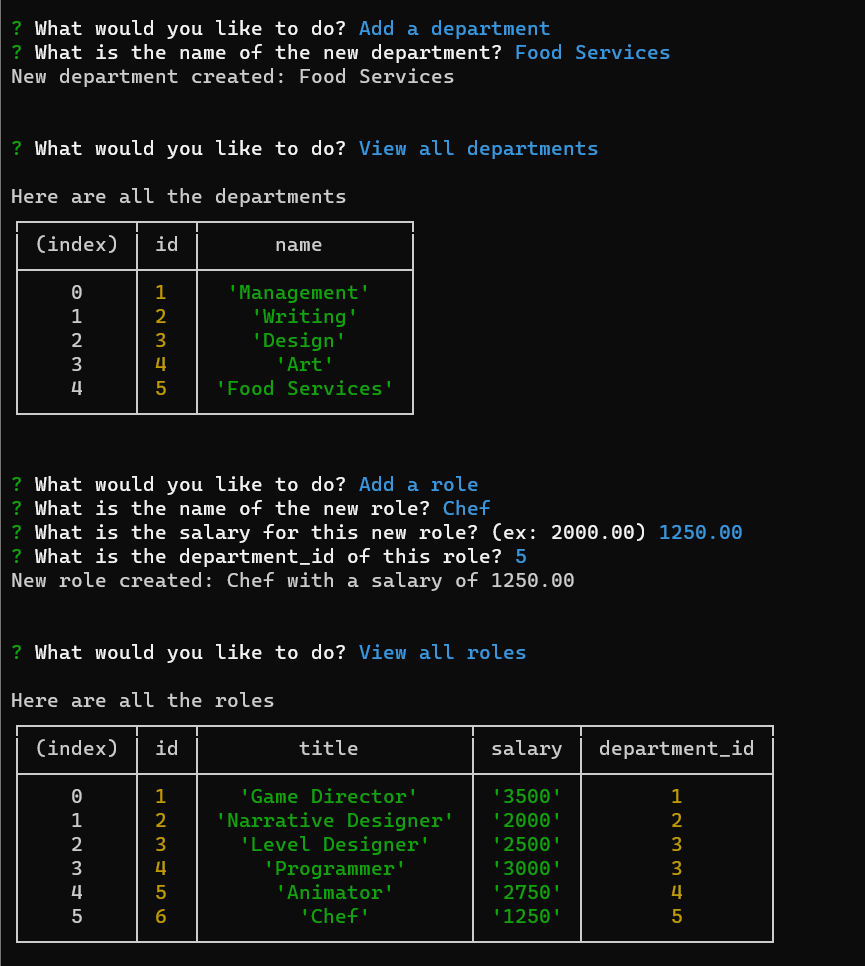

# content-management-system

## Description
This program allows a user to interact with back end data and view, add, or update any of it.

## Usage
Select an option from the list of prompts and follow the instructions to add or update any data in the data base.

Demo video: https://drive.google.com/file/d/1fAQXf_e-dRMg-ypUA0CXQhMt7GRgrNzl/view?usp=sharing

## Installation
Run npm i in command line to install all dependencies.
Using mySQL, copy and paste the contents of schema.sql and seeds.sql into mySQL workbench and execute the code to set up your database.

## Credits
Ethan Stone